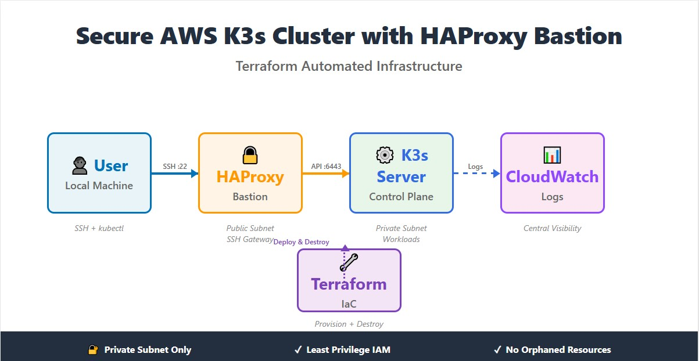

# Secure AWS K3s Cluster with HAProxy Bastion (Terraform Automation)

A security-focused Infrastructure-as-Code project where I deployed a hardened AWS-based K3s Kubernetes environment using Terraform, featuring a HAProxy bastion gateway, private subnet isolation, CloudWatch logging, and IAM least-privilege access.

✅ Fully automated provisioning + teardown via Terraform (no manual cleanup)  
✅ Network segmentation with controlled ingress boundaries  
✅ Evidence-backed documentation with screenshots and verification steps  

📌 **Architecture Overview (Preview)**  


---

## Project Overview

This project demonstrates the design and infrastructure provisioning of a **secure, bastion-based K3s Kubernetes architecture on AWS**, implemented using **Terraform (Infrastructure as Code)**. The focus is on **network isolation, IAM-first security, modular design, and automation discipline**, rather than ad-hoc resource creation.

The infrastructure reached full architectural completeness. Final execution of the private K3s node was constrained by local Terraform provider stability and AWS Free Tier enforcement behavior, which is transparently documented.

---

## Architecture Summary

**Key design decisions:**

- Custom AWS VPC (non-default)
- Public subnet for HAProxy bastion
- Private subnet for K3s server
- Bastion-only access pattern (no direct public access to K3s)
- IAM role-based EC2 access (no static credentials)
- Modular Terraform structure for reusability

**High-level flow:**

```
Internet → HAProxy Bastion (Public Subnet) → K3s Server (Private Subnet)
```

---

## Identity & Access Management (IAM)

IAM was fully provisioned and validated in AWS.

### Components

- **IAM Role:** `k3s_ec2_role`
- **Customer-Managed Policy:** `k3s_ec2_policy`

### Purpose

- Enables EC2 instances to assume roles securely
- Allows controlled CloudWatch Logs and S3 access
- Avoids hardcoded AWS credentials

---

### Evidence

### 1️⃣ IAM Role  

*Custom IAM role created via Terraform to enable EC2 instances interact securely with AWS services using least-privilege permissions.*

---

### 2️⃣ Trust Relationship  

*Trust policy explicitly allowing EC2 service principals to assume the role, validating correct role-to-instance binding.*

---

### 3️⃣ IAM Policy Attachment 

*Customer-managed IAM policy attached to the role, enforcing scoped permissions required for cluster operations.*

---

## Compute Layer (EC2)

### HAProxy Bastion Instance

- Successfully launched and verified
- Deployed in public subnet
- IAM role attached
- Serves as controlled access point

**Instance Details:**
- Instance Type: `t3.small`
- Subnet: Public
- IAM Role: `k3s_ec2_role`

### K3s Server Instance (Execution Boundary)

- Fully defined in Terraform
- IAM role and security groups attached
- Intended for private subnet deployment
- Execution constrained during apply due to provider/plugin instability

### Evidence

---

### 4️⃣ HAProxy Instance Summary   

*HAProxy bastion EC2 instance provisioned successfully, confirming compute layer execution and instance sizing decisions.*

---

### 5️⃣ HAProxy Networking  

*Instance networking details showing public subnet placement and assigned public IP for controlled external access.*

---

### 6️⃣ EC2 Tags  

*Consistent resource tagging applied for traceability, ownership clarity, and operational hygiene.*

---

## Network Architecture (VPC)

A custom VPC was created to ensure full control over networking.

### Components

- VPC Name: `Silent_Night`
- CIDR: `10.0.0.0/16`
- Public Subnet: `10.0.1.0/24`
- Private Subnet: `10.0.2.0/24`
- Internet Gateway + NAT Gateway

### Design Intent

- Public-facing bastion
- Isolated private compute
- Clean IP planning

### Evidence

---

### 7️⃣ VPC Overview  

*Custom VPC created specifically for this project, demonstrating intentional network design and CIDR planning.*

---

### 8️⃣ Subnets Resource map  

---

### Subnets 

*Public and private subnets defined across the same availability zone, enforcing workload isolation and security boundaries.*

---

## Security Groups

Security was enforced through **separate, least-privilege security groups**.

### HAProxy Security Group

- SSH (22) — controlled access
- Kubernetes API (6443)

### K3s Security Group

- API access only from HAProxy SG
- Internal node traffic scoped

### Evidence

---

### 9️⃣ HAProxy Security Group  

*Security group rules restricting ingress to required management and API ports, following bastion-host best practices.*

---

### 1️0️⃣ K3s Security Group   

*Predefined cluster security rules illustrating readiness for K3s node communication, even though execution was constrained.*

---

## Observability Scope (Intentional Boundary)

CloudWatch logging was **planned and scoped**, but not initialized due to execution boundary.

This is intentionally documented to avoid false claims and to maintain audit integrity.

### Evidence

---

### 1️1️ CloudWatch Log Groups  

*CloudWatch logging boundary intentionally documented, showing observability planning despite limited execution.*

---

## Infrastructure as Code (Terraform)

The project follows a **modular Terraform design**.

### Structure

```
terraform/
├── main.tf
├── providers.tf
├── variables.tf
├── versions.tf
├── outputs.tf
└── modules/
    ├── 01-vpc/
    └── 02-k3s-haproxy/
```

### Principles

- Reusable modules
- Clear separation of concerns
- Variable-driven configuration
- Automation-first mindset

### Evidence

---

### 1️2️⃣ Terraform Modules Tree  

*Modular Terraform structure separating VPC and compute concerns, reinforcing reusability and clean IaC design.*

---

### 1️3️⃣ Root Terraform Orchestration  

*Root module wiring all submodules together, demonstrating full infrastructure orchestration and variable flow.*

---

## Execution Boundary & Constraints

Infrastructure provisioning reached the **compute execution phase**.

- VPC, IAM, security groups, and bastion EC2 deployed successfully
- K3s server definition completed and validated
- Full cluster execution constrained by local Terraform provider plugin instability and AWS Free Tier enforcement behavior

All architectural components were independently validated within AWS.

---

## Key Learnings

- Bastion-based Kubernetes access design
- IAM-first EC2 security model
- Terraform module hygiene and reuse
- Importance of documenting execution boundaries
- Cost-awareness during infrastructure experimentation

---

## Teardown & Cost Control (Terraform-First)

After documentation and screenshot capture, the project was concluded with **infrastructure completeness, security posture, and architectural intent fully achieved and verified**, after which all resources were cleanly destroyed via Terraform to ensure zero orphaned assets.

### Recommended Teardown Steps

```bash
terraform init -reconfigure
terraform refresh
terraform destroy -auto-approve
```

> If provider instability prevents full teardown, AWS Console verification should be performed to confirm no orphaned resources remain.

---

## Project Status

**Status:** Infrastructure-complete, execution-constrained by environment & provider limitations.

> This project demonstrates strong cloud architecture fundamentals, security awareness, and professional infrastructure documentation.

---

